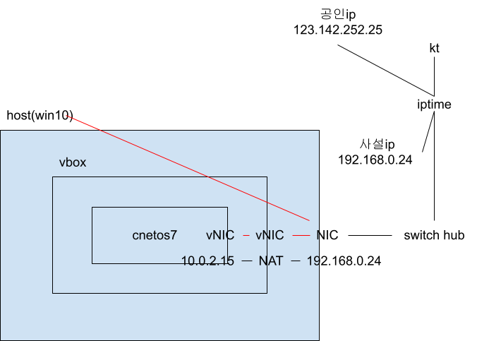

virtualbox설치
텍스트 인풋박스 마우스 오버시 마우스포인터를 아이빔이라함
메모장 글꼴 Consolas

*.iso(OS설치파일) - 이미지
dvd - desktop용 gui(graphic user interface)존재
minimal - cli(command line interface)를 사용

*-x86_64 - 인텔계열 cpu, 64비트를 나타냄

centos version
7.9.2009 - 2009는 20년09월
8-stream

## VM사양(CentOS7GNOME)
img - centos7dvd.iso
cpu - 2Core(vCPU)
ram - 4G
shared memory(VGA) - 128MB
ssd - 32G
net - NAT(Network Address Translation)
audio - X
usb - X

## VM사양(CentOS7Minial)
img - centos7minial.iso
cpu - 1core
ram - 2g
shared memory(VGA) - 9MB
ssd - 128g
net - nat

## 가상디스크(disk provisioning)
디스크 크기는 생성후 변경불가

동적할당(thin provisioning)
> 실습용,성능떨어짐(용량증가에 따라 남은용량을 계산 및 용량증가 연산 -> cpu사용),호스트 가용저장공간 이상 생성가능,사용량에 따라 파일 크기 증가 -> 이후 용량감소 X

고정크기(think provisioning)
> 초기 생성시 시간이 걸리지만 생성후 성능이 좋음(용량이 정해져있기때문에 남은 용량 계산X),정해진 용량에서 변하지 않음

## 비디오메모리
> ram에서 설정한 비디오메모리만큼 공유해서 사용함
## NAT
> mac주소를 기반으로 dhcp서버에서 ip주소를 부여받음 
 
> 공유기 같은 장비에서 사용하며 여러 머신에 사설 ip를 분배해주고 분배받은 머신이 인터넷에 접속할 경우 사설ip를 할당받은 공인ip로 변경해 접속가능하게 해준다. 
> 사설ip를 사용하는 이유는 현재 사용하고 있는 IPv4의 경우 ip의 수가 모든 머신에 분배되기에는 부족하기 때문이여 IPv6의 경우에는 ip의 수가 충분하기 때문에 필요하지 않다. 하지만 현재 IPv4의 사용이 대다수를 이루고 있기때문에 IPv6로 넘어갔을때 보안문제가 발생할 수 있어 사용이 어렵다.
## DHCP(Dynamic Host Configuration Protocol)
> MAC주소 별로 자동IP를 할당해주는 장치