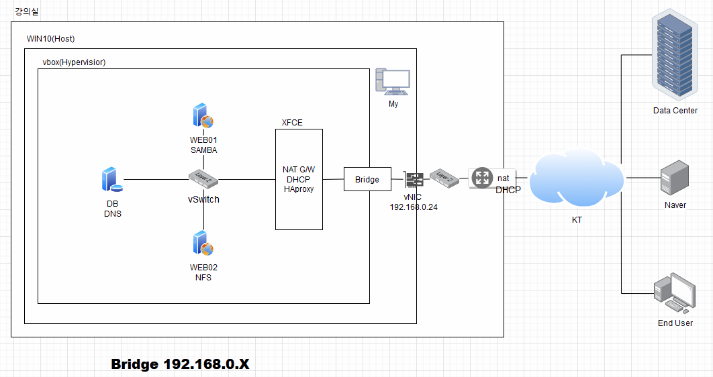

## NAT GateWay
<br/>
NAT GW_DHCP_HAproxy   
network:어댑터에 브릿지 + 내부 네트워크(vSwitch)

WEB01_SAMBA   
network:내부 네트워크(vSwitch)

WEB02_NFS   
network:내부 네트워크(vSwitch)

DB_DNS   
network:내부 네트워크(vSwitch)

## NAT GW_DHCP_HAproxy Router로 설정(NAT GW_DHCP_HAproxy)
### 리눅스 IP고정

    /etc/sysconfig/network-scripts/ifcfg-enp0s3 수정
        대소문자 구분X,””없어도 무관
        BOOTPROTO="dhcp" 로 돼있으면 자동으로 받기 때문에 none로 변경
    추가
        IPADDR=192.168.0.41
        NETMASK=255.255.255.0
        GATEWAY=192.168.0.1
            바라보는 gateway주소(공유기)
        DNS1=8.8.8.8
        DNS2=8.8.4.4
    systemctl restart network
        시스템 수정이기 때문에 재부팅 필요
        재부팅 오류시 selinux 상태확인
        disabled여야함
        아닐 경우 setenforce 0 명령어로 임시 종료 가능
    Public Subnet
        192.168.0.0/24
        192.168.0.0 ~ 192.168.0.255 (256개 IP - 2개 = 254개)
        192.168.0.0   네트워크 주소(시작 IP)
        192.168.0.255 브로드캐스팅 주소(마지막 IP)

    Private Subnet
        172.31.0.0/24
        172.31.0.0 ~ 172.31.0.255 (256개 IP - 2개 = 254개)
        172.31.0.0   네트워크 주소(시작 IP)
        172.31.0.255 브로드캐스팅 주소(마지막 IP)

### enp0s8 생성

    # vi /etc/sysconfig/network-scripts/ifcfg-enp0s8
        TYPE=Ethernet
        BOOTPROTO=none
        NAME=enp0s8
        DEVICE=enp0s8
        ONBOOT=yes
        IPADDR="172.31.0.1"
        NETMASK="255.255.255.0"
    vi 전체 삭제 명령어
        dG:현재 라인부터 마지막 라인까지 삭제

### 랜카드 분리

    # nmcli c mod enp0s3 connection.zone external
    # nmcli c mod enp0s8 connection.zone internal
    # firewall-cmd --get-active-zone
        public
            interfaces: enp0s3 enp0s8
        nmcli명령어를 통해 퍼블릭에 있던 두 네트워크 인터페이스를 분리한다. public,private명령이 통하면 좋지만 통하지 않기 때문에 external,internal로 분리한다.
        external과 public은 의미적으로 같지만 public으로 설정하면 안된다.
    # firewall-cmd --get-active-zone
        internal
            interfaces: enp0s8
        external
            interfaces: enp0s3
### 리눅스를 라우터로
\# sysctl -w net.ipv4.ip_forward=1   
해당 명령을 통해 리눅스 시스템을 라우터로 만들게 된다.   
\# cat /proc/sys/net/ipv4/ip_forward   
명령이 제대로 실행됐는지 확인   
값이 0일 경우 sysctl -p해보기(설정 저장)   

## DHCP(NAT GW_DHCP_HAproxy)
동적 호스트 구성 프로토콜 표준에서는 DHCP 서버를 사용하여 IP 주소 및 관련된 기타 구성 세부 정보를 네트워크의 DHCP 사용 클라이언트에게 동적으로 할당하는 방법을 제공

```
# yum install -y dhcp 
# vi /etc/dhcp/dhcpd.conf
    ddns-update-style interim;
    subnet 172.31.0.0 netmask 255.255.255.0 {
    = 172.31.0.0/24
    option routers 172.31.0.1;
        GateWay주소
    option subnet-mask 255.255.255.0;
    range dynamic-bootp 172.31.0.128 172.31.0.254;
        사용할 ip대역 범위 지정 -> 128~254번ip를 부여(사용)하겠다
    option domain-name-servers 8.8.8.8, 8.8.4.4;
    default-lease-time 7200;
        임대시간은 7200초(2시간)
    max-lease-time 86400;
        86400초(하루) 사용자가 요청할 수 있는 최대 시간
    }
```

### 사설IP대역
10.0.0.0~10.255.255.255
172.16.0.0~127.31.255.255
192.168.0.0~192.168.255.255

내부 네트워크
host 및 외부와 guest간의 통신은 불가능 하고 guest끼리만 통신이 가능하다.

### Port

    well-known port(알려진 포트): 0~1023(서버 포트)
        21 : FTP
        22 : SSH
        23 : HELNET
        25 : SMTP
        53 : DNS
        67 : DHCP
        80 : WEB
        443 : HTTPS
    unknown port(알려지지 않은 포트): 1024~65535
        3306 : MYSQL
        3389 : RDP

호스트 이름변경
hostnamectl set-hostname 변경할 이름
기존에 localhost라고 표시되는 이름 변경

개발 도구
virtualbox
cmd -> mobaxterm

## KeyPair
ssh-copy-id -i ./authorized_keys.pub root@172.31.0.102   
공개키 파일을 해당 주소의 .ssh/authorized_keys로 보내는 명령어로 ssh-keygen -t rsa 명령어를 통해 생성한 키 파일인 id_rsa.pub파일을 보낼경우 -i ./authorized_keys.pub 옵션을 생략할 수 있다.

프라빗 키의 접근권한이 많을 경우 키로 사용이 불가능 하기 때문에 400권한이 적당하다. 400 또는 600만 가능!
