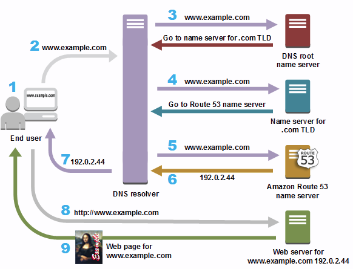

## 내부 네트워크 pc접속 방법(NAT GW_DHCP_HAproxy)
NAT GateWay 경유해서 접속
NAT GateWay접속 후 내부 네트워크ip를 통해 ssh로 접속

### 포트포워딩

    NAT GateWay IP : 192.168.0.41
    WEB01 : 172.31.0.100
    WEB02 : 172.31.0.102
    DB : 172.31.0.101

    192.168.0.41:221 -> 172.31.0.100:22(WEB01)
    192.168.0.41:222 -> 172.31.0.102:22(WEB02)
    192.168.0.41:223 -> 172.31.0.101:22(NS)

    # firewall-cmd --permanent --zone=external --add-forward-port=port=221:proto=tcp:toport=22:toaddr=172.31.0.100
        221 port로 접속하면 172.31.0.100:22로 보내라
    # firewall-cmd --reload
    # firewall-cmd --list-all --zone=external
        설정이 잘 됐는지 확인

모든 세션에 동일 명령어 사용
MultiExec클릭

## DNS
호스트의 도메인 이름을 호스트의 네트워크 주소로 바꾸거나 그 반대의 변환을 수행   
   
DNS resolver = ISP(Internet Service Provider: KT,SKB,LGU+, etc)

### 설치(DB_NS)

    # yum -y install bind bind-chroot bind-utils
    # vi /etc/named.conf
        options {
                listen-on port 53 { 127.0.0.1; 192.168.0/24; 172.31.0/24; };
                    172.31.0/24 = 172.31.0.0/24
                    마지막 0이 생략된 형태
                listen-on-v6 port 53 { ::1; };
                directory   	"/var/named";
                dump-file   	"/var/named/data cache_dump.db";
                statistics-file "/var/named/data/named_stats.txt";
                memstatistics-file "/var/named/data/named_mem_stats.txt";
                recursing-file  "/var/named/data/named.recursing";
                secroots-file   "/var/named/data/named.secroots";
                allow-query 	{ localhost; 192.168.0/24; 172.31.0/24; };
                forwarders { 8.8.8.8; 8.8.4.4; };
                    찾는 주소가 없으면 물어볼 곳 주소
                    현재 주소는 구글

                recursion yes;

                dnssec-enable yes;
                dnssec-validation yes;

                /* Path to ISC DLV key */
                bindkeys-file "/etc/named.iscdlv.key";

                managed-keys-directory "/var/named/dynamic";

                pid-file "/run/named/named.pid";
                session-keyfile "/run/named/session.key";
        };

        logging {
                channel default_debug {
                        file "data/named.run";
                        severity dynamic;
                };
        };
        view "internal" {
                zone "." IN {
                        type hint;
                        file "named.ca";
                };

                include "/etc/named.rfc1912.zones";
                include "/var/named/clown18.shop.zones";
                    호스팅 영역 생성
        };
    # vi /var/named/clown18.shop.zones
        zone "clown18.shop" IN {
                type master;
                file "clown18.shop.db";
                    도메인을 ip로 맵핑시키는 정보를 갖고있는 파일
                allow-update { none; };
        };
        domain을  ip로 변경

        zone "0.31.172.in-addr.arpa" IN {
                type master;
                file "0.31.172.in-addr.arpa.db";
                    ip를 도메인으로 맵핑시키는 정보를 갖고있는 파일
                allow-update { none; };
        };
        ip를 domain으로 변경
    # vi /var/named/clown18.shop.db
        $TTL	86400
        @   	IN  	SOA 	clown18.shop.   root.clown18.shop.(
                                2022041401 ; Serial
        버전 정보로 일반적으로 날짜+버전
                                3h     	; Refresh
                                1h     	; Retry
                                1w     	; Expire
                                1h )   	; Minimum

                IN  	NS  	ns.clown18.shop.
                IN  	MX 10   ns.clown18.shop.
        ns  	IN  	A   	172.31.0.101
        web01   IN  	A   	172.31.0.100
        web02   IN  	A   	172.31.0.102
    SOA NS A등등은 레코드
    SOA  : 다루는 도메인 버전과 업데이트 시간 간격 등의 정보를 저장하는 레코드
    A	: 호스트 이름으로 IPv4 주소를 조회할 때 사용하는 레코드
        예: 호스트 ns.clown18.shop의 IPv4 주소는 172.31.0.130
    AAAA : 호스트 이름으로 IPv6 주소를 조회할 때 사용하는 레코드
        예: jprs.jp의 IPv6 주소는 2001:218:3001:7::80
    PTR  : IP 주소로 호스트 이름을 조회할 때 사용하는 레코드
        예: 172.31.0.130의 호스트 이름은 ns.clown18.shop
    NS   : DNS 서버의 호스트 이름 혹은 IP 주소를 저장하는 레코드
        예: clown18.shop의 DNS 서버는 ns.clown18.shop
    MX   : 메일 서버 호스트 이름 혹은 IP 주소를 저장하는 레코드
        예: clown18.shop의 메일 서버는 mail.clown18.shop
    CNAME: 호스트 이름의 별칭을 저장하는 레코드,도메인을 도메인으로 변환
        예: www.clown18.shop은 ns.clown18.shop의 별칭
    AWS Route 53 사용시 AOS, NS 는 수정할 수 없다.
    
    # vi /var/named/0.31.172.in-addr.arpa.db
        $TTL    86400
        @    IN    SOA    clown18.shop.    root.clown18.shop.(
                2022041401 ; Serial
                3h     	; Refresh
                1h     	; Retry
                1w     	; Expire
                                1h )   	; Minimum

            IN    NS    ns.clown18.shop.
        101    IN    PTR    ns.clown18.shop.
        NS ip의 마지막 주소

    # systemctl enable –now named
        재시작 설치시에는 bind지만 재시작을 위해 접근할때는 named
        재시작 안되면 systemctl status named를 통해 에러 부분을 확인할 수 있다.
    # firewall-cmd –permanent –add-ervice=dns
    # firewall-cmd –reload
    dns요청을 허용하기 위해 방화벽을 열어준다.

    DHCP수정(NAT GW_DHCP_HAproxy)
        # vi /etc/dhcp/dhcpd.conf
            dns서버 주소(172.31.0.101)추가
            dhcp설정을 변경했기 때문에 재시작 필요
            guestPC NetworkManager재시작
            cat /etc/resolv.conf 명령을 통해 dns가 추가 됐는지 확인
        # vi /etc/sysconfig/network-scripts/ifcfg-enp0s3
            DNS1=172.31.0.100 # NS서버 주소
            접속이 끊길경우 NAT pc 재부팅으로 해결 가능

    확인
        dig A web01.clown18.shop
            ANSWER SECTION:에서 ip가 맞게 나오는지 확인
        dig -x 172.31.0.102
            ANSWER SECTION:에서 등록한 도메인이 맞게 나오는지 확인
            dig없으면 yum install bind-utils

## HAproxy(NAT GW_DHCP_HAproxy) - AWS ELB - 로드밸런서 - 부하분산
HAProxy는 여러 서버에 요청을 분산시키는 TCP 및 HTTP 기반 애플리케이션을 위한 고가용성(7/24/365 서비스 제공) 로드 밸런서 및 역방향 프록시를 제공하는 무료 오픈 소스   

    # yum install -y haproxy
    # vi /etc/haproxy/haproxy.cfg
    global
        daemon

    defaults - 접속하는 프로토콜
        mode           	http

    frontend  http-in
        bind *:80
            기본 포트번호인 80번 포트로 들어왔을때 backend_servers로 연결 한다.
        default_backend	backend_servers
            두개의 서버를 backend_servers로 그룹화

    backend backend_servers
        balance        	roundrobin
            부하분산 알고리즘 설정 roundrobin - 균등 분산
        cookie  SVID insert indirect nocache maxlife 3m
            쿠키 지속시간 설정
        server         	web01 172.31.0.100:80 cookie check
        server         	web02 172.31.0.102:80 cookie check

    # systemctl enable –now haproxy

    WebServer(NAT)
        firewall-cmd –permenant –add-service=http –zone=external
