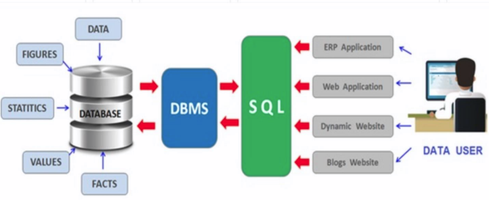

내부네트워크 사용이유   
private sub을 내부 네트워크로 만들기 때문에 외부에서 바로 접속이 불가능 하고 nat를 통해야만 통신이 가능하다. 보안측면에서 좋다.   

HAproxy - Load Balancing(부하분산) - Fail Over(하나에 문제가 생기면 대기하고 있던 서버가 그 역활을 한다.) - Health Check(상태 검사)   
Cluster(클러스터) - 여러 서버를 하나의 그룹으로 묶어 하나의 서버처럼 동작하는 서버들의 집합이며 haproxy는 클러스터 내부의 서버들에게 주기적으로 Health Check(상태 검사)를 한다.   

## DB설치
### repo정의
centos에서 기본 제공하는 버전이 아닌 특정버전(최신)을 받기위해 어떤버전을 받을지 어디서 받을지 등의 내용을 정의한다.

```
# mysql_secure_installation
    mariadb보안 설정
    Switch to unix_socket authentication [Y/n] y
    Change the root password? [Y/n] y
        root비밀번호 변경 할지
    Remove anonymous users? [Y/n] y
        anonymous계정 삭제
    Disallow root login remotely? [Y/n] y
        root계정 원격로그인 허용 안할지
    Remove test database and access to it? [Y/n] y
        test db삭제할지
    Reload privilege tables now? [Y/n] y
        설정사항 바로 적용할지
```

### 외부 접속용 계정 및 db 생성

    CREATE USER 'wpuser'@'%' IDENTIFIED BY 'wppass';
        %가 들어있는 부분이 접속가능한 ip가 들어가는 부분으로 %의 의미는 anyware로 어디서든 접속가능하게 한다는 뜻이며 아이디는 wpuser 비밀번호는 wppass로 계정 생성
    CREATE DATABASE IF NOT EXISTS wordpress;
        wordpress db가 없으면 생성
    GRANT ALL PRIVILEGES ON wordpress.* TO 'wpuser'@'%';
        wordpree db안에 모든 테이블에 대한 모든 권한을 wpuser에게 부여
    wordpress.*는 wordpress db안에 있는 모든 테이블

### 외부 접속시

    mysql -h ServerIP -u ID -p

    오류
        ERROR 2003 (HY000): Can't connect to MySQL server on
            db서버 방화벽 확인
        ERROR 1045 (28000): Access denied for user
            해당 ID접근 권한 확인

## 데이터베이스
대용량의 데이터 집합을 체계적으로 구성해 놓은것 으로 혼자 사용하는 목적이 아닌 여러 명의 사용자나 시스템이 서로 공유 가능해야 한다.

특징

    데이터의 무결성
        CRUD 등의 연산 후에도 데이터베이스에 저장된 데이터가 정해진 제약 조건을 항상 만족해야 한다.

    데이터의 독립성
        데이터베이스의 크기를 변경하거나 데이터 파일의 저장소를 변경해도 기존에 작성된 응용프로그램에 영향을 미치면 안된다.

    보안
        데이터베이스 안의 데이터는 아무나 접근할 수 있는 것이 아니라, 데이터를 소유한 사람이나 데이터의 접근이 허가된 사람만이 데이터에 접근할 수 있어야 한다.

    데이터 중복의 최소화
        데이터베이스에 통합하면 하나의 테이블에 저장하고 이를 공유함으로써 데이터 중복이 최소화 된다.

    응용프로그램 제작 및 수정 용이
        통일된 방식으로 응용프로그램 작성이 가능해지고, 유지보수가 쉬워진다.

열(columns)과 행(row)으로 이루어진 table이 모여 데이터베이스를 구성한다.
용어

    데이터
        하나하나의 단편적인 정보
    테이블
        데이터를 입력하기 위해 표 형태로 표현한 것
    데이터베이스
        테이블이 저장되는 저장소
    DBMS
        데이터베이스를 관리하는 시스템 또는 소프트웨어
    열(Column)
        각 테이블은 열로 구성
    열 이름
        각 열을 구분하기 위한 이름으로 테이블 내에서 고유해야 한다.
    데이터 형식
        문자,숫자 형식이며 테이블을 생성할 때 지정해야 한다.
    행
        실질적인 데이터
    기본 키(PK)
        각 행을 구분하기 위한 유일한 열을 말하며 식별자로 이용
    외래 키(FK)
        두 테이블의 관계를 맺어주는 키

## SQL
구조적 쿼리 언어(Structured Query Language)를 나타내며 데이터베이스와 통신하는 데 사용. 관계형 데이터베이스(SQL <-> NoSQL) 관리 시스템의 표준 언어로 데이터베이스에서 데이터 업데이트, 검색과 같은 작업을 수행하는 데 사용. 기본 포트로 3306포트를 사용한다.

표준 SQL
>select:조회
insert:입력
update:수정
delete:삭제
create:생성
drop:삭제

   

gui도구
HeidSQL

명령어

    SETX PATH "C:\Program Files\MariaDB 10.3\bin;%PATH%" /M
        어느 경로에서든 실행파일을 실행 가능하게 하는 설정
    source employees.sql;
        employees.sql데이터를 db에 삽입
