## 서버 구성변경
    NAT G/W
        DHCP
        HAproxy
        DNS
    WEB01(HTTPD)
    WEB02(NGINX)
    WEB03(IIS)
        Database
        SAMBA
        NFS

Router의 필수 기능은 NAT G/W만 있어도 되고 그외의 기능들은 추가기능이다.

### VM
VMnet1(HostOnly),VMnet8(NAT)은 가상의 랜카드로 생성되어있다.   
VMnet0는 실제 랜카드에 설치되어있다.(VMware Bridge Protocol)   

### IP
32비트 주소 체계를 사용하며 0~24비트는 네트워크 영역 25~32비트는 호스트 영역이다.

#### 사설 IP
A Class - 10.0.0.0 ~ 10.255.255.255   
B Class - 172.16.0.0 ~ 172.31.255.255   
C Class - 192.168.0.0 ~ 192.168.255.255   

## 환경설정
명령어 자동 완성(명령어 옵션)   
```
# yum install -y bash-completion   
세션 재접속 필요
```

## Router 설정
vbox에서의 네트워크 인터페이스인 enp0s3가 vmware에서는 ens32로 enp0s8은 ens33으로 이름이 설정되어있다.

### ens32 IP고정
```
# vi /etc/sysconfig/network-scripts/ifcfg-ens32
    TYPE=Ethernet
    BOOTPROTO=none
    NAME=ens32
    DEVICE=ens32
    ONBOOT=yes
    IPADDR=192.168.0.212
    NETMASK=255.255.255.0
    GATEWAY=192.168.0.1
    DNS1=8.8.8.8
    DNS2=8.8.4.4
```

### ens33 IP고정
```
# vi /etc/sysconfig/network-scripts/ifcfg-ens33
    TYPE=Ethernet
    BOOTPROTO=none
    NAME=ens33
    DEVICE=ens33
    ONBOOT=yes
    IPADDR=10.0.21.1
    NETMASK=255.255.255.0
```

### 내/외부 구분
```
# nmcli c mod ens32 connection.zone external
# nmcli c mod ens33 connection.zone internal
    네트워크 매니저를 통해 내/외부로 구분해준다.

# sysctl -w net.ipv4.ip_forward=1
    internal에 있는 네트워크에서 인터넷에 접속하기 위해서는 external과 통신이 필요하다. 이를 ip forwarding을 통해 인터페이스간 패킷통신을 통해 해결하며 해당 명령어를 통해 설정가능하지만 nmcli명령어를 통해 네트워크의 존을 구분해주면서 네트워크매니저가 자동으로 설정하는 경우가 있다.
# cat /proc/sys/net/ipv4/ip_forward
    값이 1인지 확인, 0일경우 위 명령어를 통해 변경, 변경사항이 저장되지 않을경우 # sysctl -p해보기
```

## DHCP
사용가능한 최대 IP의 범위는 2~254까지 가능하다.
0 : 네트워크
1 : Router

```
# vi /etc/dhcp/dhcpd.conf
    ddns-update-style interim;
    subnet 10.0.21.0 netmask 255.255.255.0 {
    option routers 10.0.21.1;
    option subnet-mask 255.255.255.0;
    range dynamic-bootp 10.0.21.100 10.0.21.110;
    option domain-name-servers 10.0.21.1, 8.8.8.8, 203.248.252.2;
    default-lease-time 7200;
    max-lease-time 86400;
    }
10.0.21.1 : 내부 DNS
8.8.8.8 : 구글 DNS
203.248.252.2 : LG DNS
```
IP 확인   
nat : 192.168.0.212 / 10.0.21.1   
web01 : 10.0.21.2   
web02(ubuntu) : 10.0.21.5   
web03 : 10.0.21.4   
DB : 10.0.21.3   

### IP를 토대로 포트포워딩
```
# firewall-cmd --permanent --zone=external --add-forward-port=port=221:proto=tcp:toport=22:toaddr=10.0.21.2
# firewall-cmd --permanent --zone=external --add-forward-port=port=222:proto=tcp:toport=22:toaddr=10.0.21.5
# firewall-cmd --permanent --zone=external --add-forward-port=port=223:proto=tcp:toport=22:toaddr=10.0.21.3
# firewall-cmd --permanent --zone=external --add-forward-port=port=3389:proto=tcp:toport=3389:toaddr=10.0.21.4
    윈도우 원격데스크톱용
# firewall-cmd --reload
# firewall-cmd --list-all --zone=external
```

## DNS
### 설치
```
# yum -y install bind bind-chroot bind-utils
```

### 설정
```
# vi /etc/named.conf
    options {
            listen-on port 53 { 127.0.0.1; 192.168.0/24; 10.0.21/24; };
                # 네임서버에 접근 가능한 IP
            listen-on-v6 port 53 { ::1; };
            directory       "/var/named";
            dump-file       "/var/named/data/cache_dump.db";
            statistics-file "/var/named/data/named_stats.txt";
            memstatistics-file "/var/named/data/named_mem_stats.txt";
            recursing-file  "/var/named/data/named.recursing";
            secroots-file   "/var/named/data/named.secroots";
            allow-query     { localhost; 192.168.0/24; 10.0.21/24; };
                # 네임서버에 질문할 수 있는 IP
            forwarders { 8.8.8.8; 203.248.252.2; };

            recursion yes;

            dnssec-enable yes;
            dnssec-validation yes;

            /* Path to ISC DLV key */
            bindkeys-file "/etc/named.iscdlv.key";

            managed-keys-directory "/var/named/dynamic";

            pid-file "/run/named/named.pid";
            session-keyfile "/run/named/session.key";
    };

    logging {
            channel default_debug {
                    file "data/named.run";
                    severity dynamic;
            };
    };
    view "internal" {
            zone "." IN {
                    type hint;
                    file "named.ca";
            };

            include "/etc/named.rfc1912.zones";
            include "/var/named/clown.shop.zones"; # 호스팅 영역 생성
    };


# vi /var/named/clown.shop.zones
    zone "clown.shop" IN {
            type master;
            file "clown.shop.db";
            allow-update { none; };
    };

    zone "21.0.10.in-addr.arpa" IN {
            type master;
            file "21.0.10.in-addr.arpa.db";
            allow-update { none; };
    };

도메인을 IP로 변환하는 정보 들이 들어있다.
# vi /var/named/clown.shop.db
    $TTL    86400
    @       IN      SOA     clown.shop.   root.clown.shop.(
                            2022041401 ; Serial
                            3h         ; Refresh
                            1h         ; Retry
                            1w         ; Expire
                            1h )       ; Minimum

            IN      NS      ns.clown.shop.
            IN      MX 10   ns.clown.shop.
    ns      IN      A       10.0.21.1
    web01   IN      A       10.0.21.2
    web02   IN      A       10.0.21.5
    web03   IN      A       10.0.21.4
    DB      IN      A       10.0.21.3
IP를 도메인으로 변환하는 정보가 담겨있다.
CNAME을 주고싶을 경우
name      IN      CNAME     web01
name.clown.shop으로 ping을 칠 경우 web01로 ping이 나간다.

# vi /var/named/21.0.10.in-addr.arpa.db
    $TTL	86400
    @	IN	SOA	clown.shop.	root.clown.shop.(
                2022041401 ; Serial
                3h         ; Refresh
                1h         ; Retry
                1w         ; Expire
                            1h )       ; Minimum

        IN	NS	ns.clown.shop.
    1	IN	PTR	ns.clown.shop.
```
설정 완료후 재시작 및 방화벽 등록 필요   
\# firewall-cmd --permanent --add-service=dns --zone=internal

윈도우 명령어   
ipconfig /flushdns : DNS 캐시 삭제

리눅스 명령어   
nslookup web01.clown.shop   
dns가 잘 설정되었는지 확인   
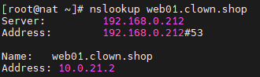   

## Static Routing Table
route add 10.0.21.0 mask 255.255.255.0 192.168.0.212   
윈도우 명령어로 라우팅 테이블에 192.168.0.212라우터를 추가   

## 윈도우 원격 데스크톱
Allow remote access to your computer
Allow remote connections to this computer 체크해제
Allow connections only ... - 체크 해제

### 안될경우
Windows Firewall with Advanced Security   
Inbound Rules -> new Rule   
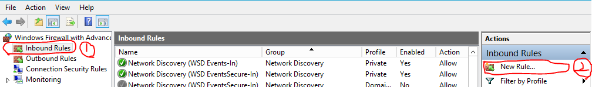   
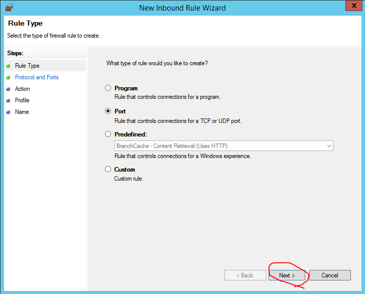   
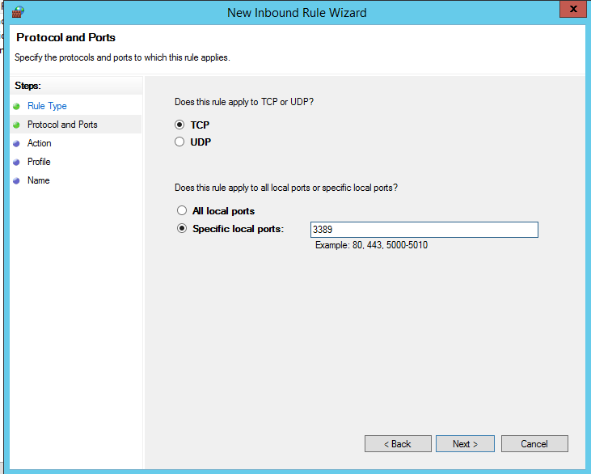   
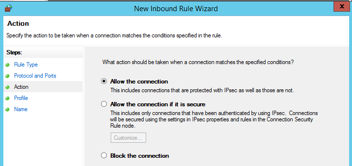   
3389/TCP 추가

## DB서버
### 설치
```
# vi /etc/yum.repos.d/MariaDB.repo
    [mariadb]
    name = MariaDB
    baseurl = http://yum.mariadb.org/10.4/centos7-amd64
    gpgkey=https://yum.mariadb.org/RPM-GPG-KEY-MariaDB
    gpgcheck=1
# yum install -y MariaDB
    위에서 설정한 name값
```
버전 확인   
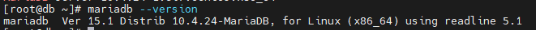   

보안 설정
```
# mysql_secure_installation
```
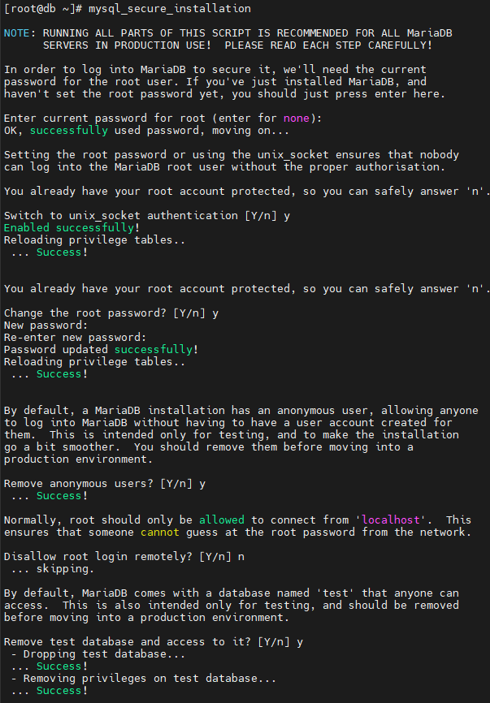   
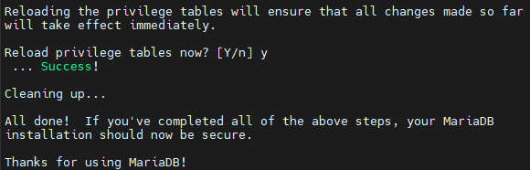   

## HTTPD
### web01(Centos7)
```
# yum install -y httpd
```

### web02(Ubuntu)
```
$ sudo apt-get update
$ sudo apt-get install -y nginx
```

### web03(Window Server)
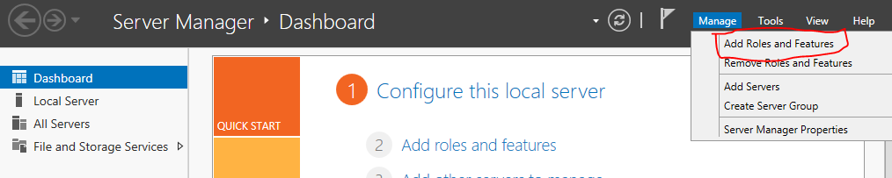   
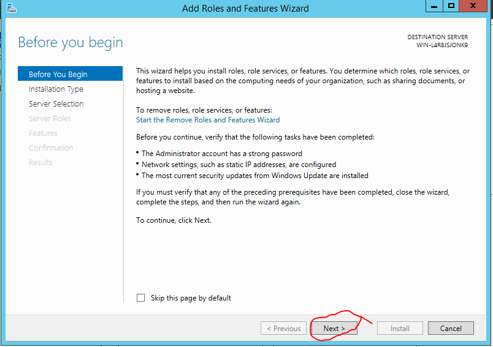   
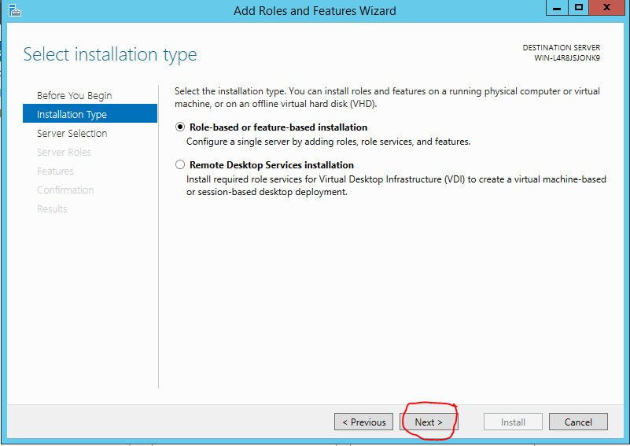   
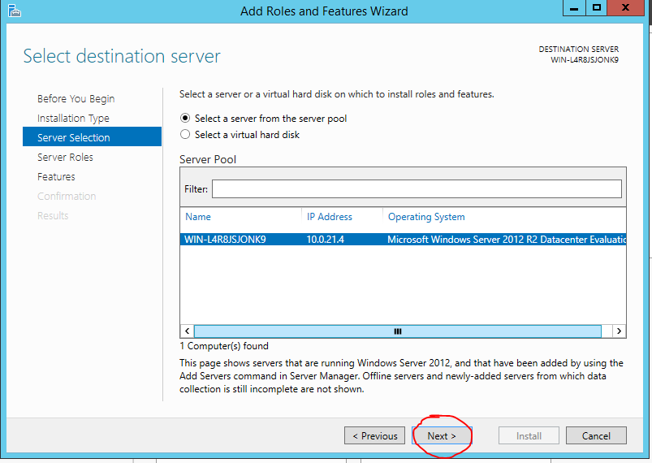   
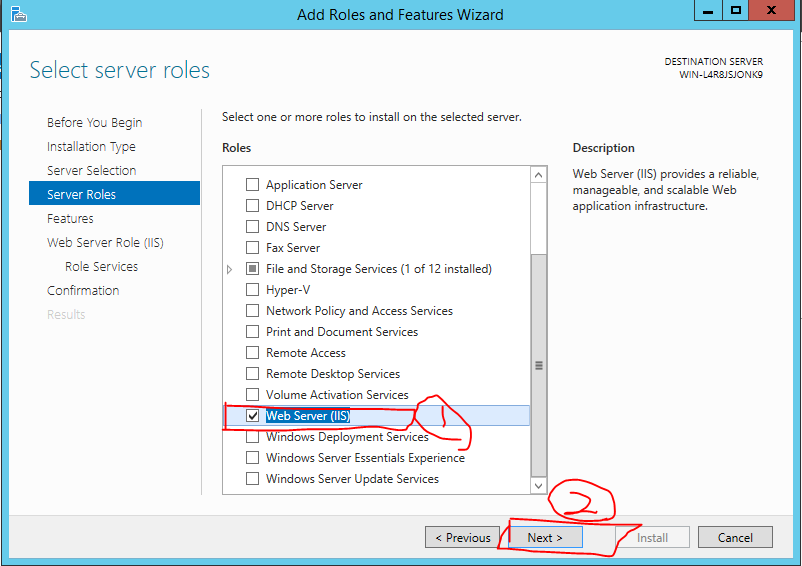   
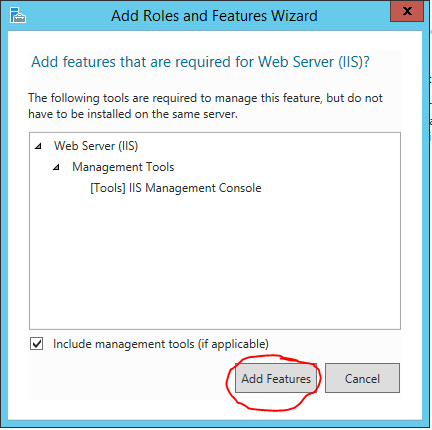   
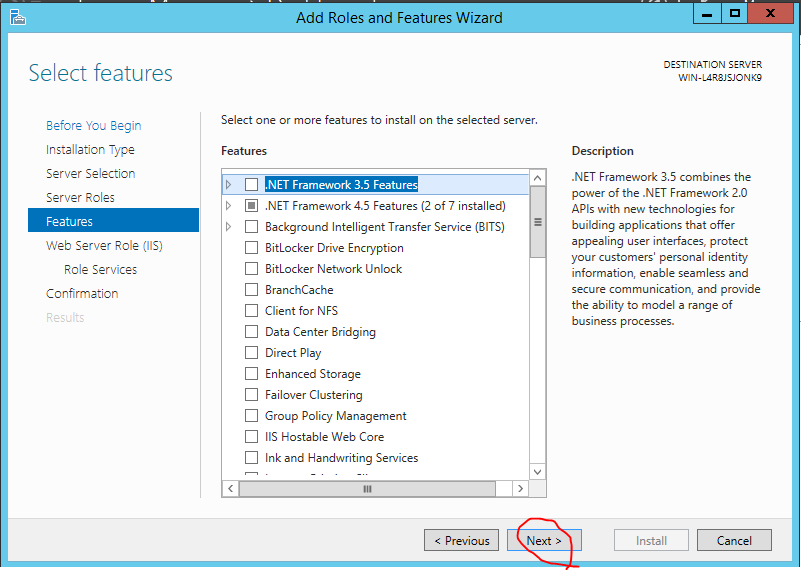   
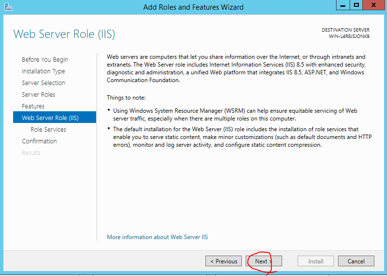   
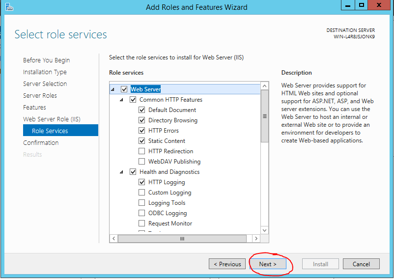   
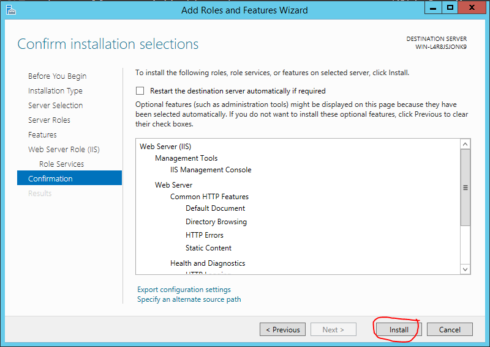   
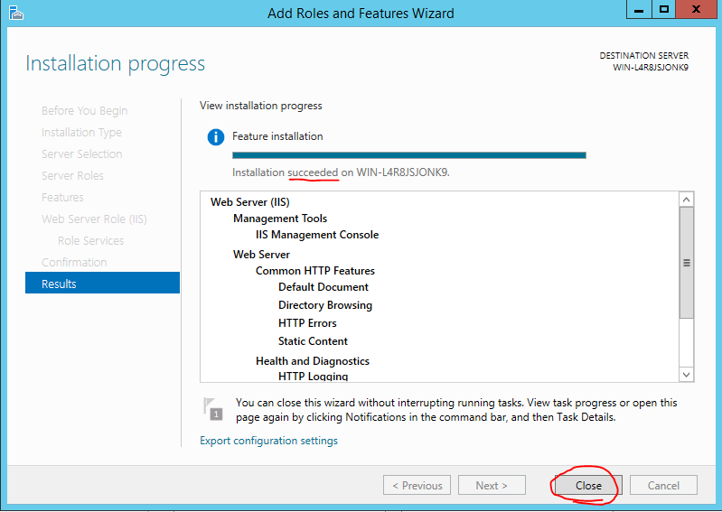   

## HAproxy
```
# yum install -y haproxy
# vi /etc/haproxy/haproxy.cfg
    global
        daemon

    defaults
        mode               http

    frontend  http-in
        bind *:80
        default_backend    backend_servers

    backend backend_servers
        balance            roundrobin
    #    cookie  SVID insert indirect nocache maxlife 3m
        server             web01 10.0.21.2:80 cookie check
        server             web02 10.0.21.5:80 cookie check
        server             web03 10.0.21.4:80 cookie check
```