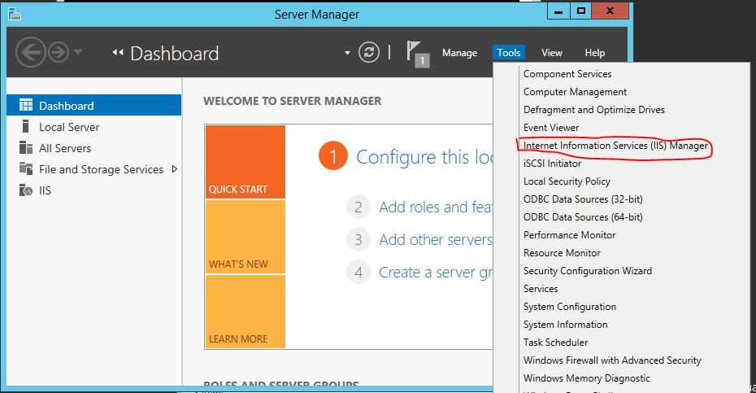
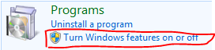
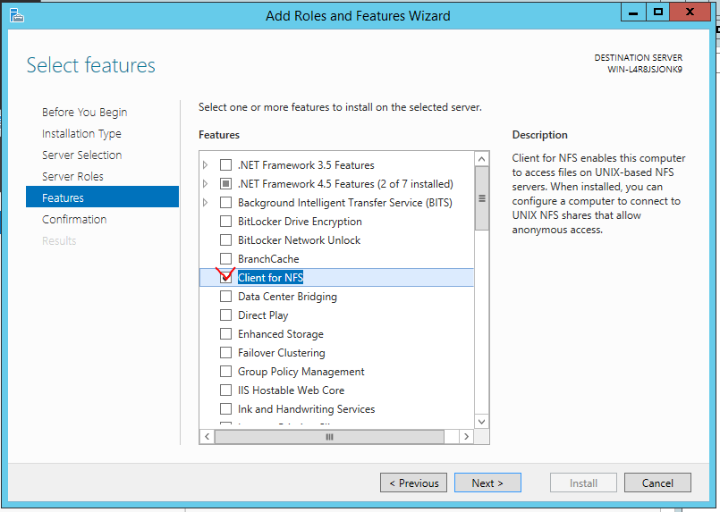

어제 설정한 HAproxy를 통한 로드밸런싱의 경우 처음에만 web01로 연결되고 이후 web02, web03만 연결되는 현상이 발견됨   
페이지 별로 용량이 달라서 그런 것으로 페이지를 같게 만들어주니 잘 작동하는것을 확인했다.   

### Centos7
HTTPD(Apache)   
html root folder - /var/www/html/   

### Ubuntu
HTTPD(Nginx)   
/usr/share/nginx/html - docker기본경로   
/var/www/html/ - 우분투에서 현재 바라보는곳   

### Windows
IIS   
C:\inetpub\wwwroot   

### 리눅스 명령어
history : 사용했던 명령어 이력 확인   
-c : 히스토리 리스트 삭제   
!! : 직전 명령어 재실행   
!n : n번째 사용했던 명령어 재실행   
!-n : 역순으로 n번째 명령어 실행   

## HAproxy
쿠키를 사용했을때 web01에서만 쿠키가 적용되는 현상 발생   
쿠키 이름을 사용하지 않아서 생기는 문제로 이름을 사용함으로써 해결   
```
# vi /etc/haproxy/haproxy.cfg
    global
    daemon

    defaults
        mode               http

    frontend  http-in
        bind *:80
        default_backend    backend_servers

    backend backend_servers
        balance            roundrobin
        cookie             SVID insert indirect nocache maxlife 10s
        server             web01 10.0.21.2:80 cookie w1 check
        server             web02 10.0.21.5:80 cookie w2 check
        server             web03 10.0.21.4:80 cookie w3 check
```
w1,w2,w3이 쿠키 이름으로 이름은 아무거나 사용해도 무관

## WordPress
https://ko.wordpress.org/ -> 5.9.3다운   

### WinServer
   
Web Platform Installer 설치   
PHP 7.4.13(x86) 설치   

### Centos7
php 7.4설치   
```
# yum -y install http://rpms.remirepo.net/enterprise/remi-release-7.rpm
# yum -y install epel-release yum-utils
# yum-config-manager --enable remi-php74
    워드프레스 5.9.3버전이 php5.4에서 작동 안함, php7.4버전 필요
```
HTTP 설치
```
# yum install -y httpd php php-mysql php-gd php-mbstring wget unzip
# chown -R apache:apache /var/www/*
```

### Ubuntu18
```
$ sudo apt update && sudo apt upgrade -y
$ sudo apt install -y nginx
$ sudo apt install -y php7.2 php7.2-mysql php7.2-mbstring php7.2-gd php7.2-fpm wget unzip
$ sudo mkdir -p /var/www/html/wordpress/public_html
$ cd /etc/nginx/sites-available
$ sudo vi wordpress.conf
    server {
        listen 80;
        root /var/www/html/wordpress/public_html;
        index index.php index.html;
        server_name nat.clown18.shop;

            access_log /var/log/nginx/SUBDOMAIN.access.log;
            error_log /var/log/nginx/SUBDOMAIN.error.log;

        location / {
            try_files $uri $uri/ =404;
        }

        location ~ \.php$ {
            include snippets/fastcgi-php.conf;
            fastcgi_pass unix:/run/php/php7.2-fpm.sock;
        }
        
        location ~ /\.ht {
            deny all;
        }

        location = /favicon.ico {
            log_not_found off;
            access_log off;
        }

        location = /robots.txt {
            allow all;
            log_not_found off;
            access_log off;
        }
    
        location ~* \.(js|css|png|jpg|jpeg|gif|ico)$ {
            expires max;
            log_not_found off;
        }
    }

server_name 및 해당 포트로 접속했을때 실행된다.
$ sudo nginx -t
    설정확인

$ cd /etc/nginx/sites-enabled
$ sudo ln -s ../sites-available/wordpress.conf .
$ sudo systemctl reload nginx
$ cd /var/www/html/wordpress/public_html
$ sudo wget https://ko.wordpress.org/latest-ko_KR.zip
$ sudo unzip latest-ko_KR.zip
$ sudo mv wordpress/* .
$ sudo chown -R www-data:www-data *
$ sudo chmod -R 755 *
```

### 클라우드 3대 스토리지
#### Block Storage - AWS EBS(Elastic Block Store)
디스크 추가후 mount
OS, App 설치

#### File Storage - AWS EFS(Elastic File Storage)
폴더 공유(네트워크를 통해 폴더 공유, 파일 공유)
SMB,NFS

#### Object Storage - AWS S3(Simple Storage Service)
url 파일공유, http서버 탑재
WebShare

## NFS
### 서버 
```
# yum install -y nfs-utils
# mkdir /share
# vi /etc/exports
    /share 10.0.21.0/24(rw,sync)

# chmod 707 /share
# systemctl start nfs-server
# systemctl enable nfs-server
# systemctl enable --now nfs-server
# exportfs -v
    /share                10.0.21.0/24(sync,wdelay,hide,no_subtree_check,sec=sys,rw,secure,root_squash,no_all_squash)
    디렉토리 와 접근가능한 IP,권한 확인
    rw : 읽기,쓰기
    ro : 읽기전용
    sync : 파일시스템 변경시 즉시 동기화
    secure : 클라이언트의 마운트요청시 1024이하의 포트를 사용
    noaccess : 액세스거부
    root_squach : 클라이언트의 서버root권한 획득을 막기(default) 서버에서 생성된 파일을 수정못함
    no_root_squash : 클라이언트 root계정과 서버의 root계정을 동일하게봄 서버에서 생성된 파일 수정가능
    all_squach : root를 제외하고 서버와 클라이언트의 사용자를 동일한 권한으로 설정
    no_all_squach : root를 제외하고 서버와 클라이언트의 사용자들을 하나의 권한을 가지도록 설정

# firewall-cmd --permanent --add-service=nfs
# firewall-cmd --permanent --add-service=rpc-bind
# firewall-cmd --permanent --add-service=mountd
    3가지 모두 열려있어야 가능
# firewall-cmd --reload
```

### 클라이언트
#### nat,web01(Centos7)
```
# rpm -qa | grep nfs-utils
# yum install -y nfs-utils
# showmount -e 10.0.21.3
# mkdir share
# mount -t nfs 10.0.21.3:/share /root/share
# vi /etc/fstab
    db.clown18.shop:/share /root/share nfs defaults 0 0
```

#### web02(Ubuntu)
```
$ sudo apt-get install -y nfs-common
```

#### web03(Win)
   
   
터미널에서
\> mount db.clown18.shop:/share Z:\
