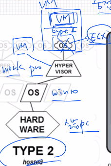

## HAproxy
### L4(Transport Layer)
TCP/UDP 방식으로 특정포트를 통해 들어오는 트래픽을 포워딩   
### L7(Application Layer)
설정 변경   
```
global
    daemon

defaults
    mode               http

frontend  http-in
    bind *:80 # L4 S/W
    acl firefox hdr_sub(User-Agent) Firefox
#   acl : access control list(접근 제어 목록)
#   firefox는 이름으로 아무거나 설정 가능
#   http header중 User-Agent의 값이 Firefox인 트래픽
#   User-Agent에는 접근한 브라우저 정보가 담겨있다.
#   L7 S/W(Content S/W) - S/W는 switch
    acl chrome hdr_sub(User-Agent) Chrome
    default_backend    backend_servers
    use_backend bk_firefox if firefox
    use_backend bk_chrome if chrome


backend backend_servers
    balance            roundrobin
#    cookie  SVID insert indirect nocache maxlife 3m
    server             web01 10.0.21.2:80 cookie w1 check
    server             web02 10.0.21.5:80 cookie w2 check
    server             web03 10.0.21.4:80 cookie w3 check

backend bk_firefox
    server             web01 172.31.0.101:80
backend bk_chrome
    server             web02 172.31.0.100:80

    firefox로 접근시 web01로 chrome로 접근시 web02로 접근된다.
    default_backend가 없을경우 firefox와 chrome외의 브라우저로 접속시 503에러가 발생한다.
```

## 타입1 테스트 환경
중첩된 가상화 사용(nested virtualization)   
실습 환경에서 타입1구성이 어렵기 때문에 타입2환경에서 하이퍼 바이저 위에 만든 VM안에 추가적인 VM을 만들어 환경 구성   


### VMware ESXi(6.7.0) 설치
사양

    CPU : 4C
    RAM : 10Gb
    DISK : 128Gb
    NET : Bridge
    IMG : VMware _ ESXi.iso

CPU 가상화(HVM)

    중첩된 가상화를 위해 사용
    Intel VT-x
    AMD-V

접속 방법
웹브라우저를 통해 설치 종료후 나온 IP로 접속

VM생성시 디스크가 씬 프로비저닝인지 꼭 확인
VM사양(Linux)

    CPU : 1C
    RAM : 1G
    DISK : 100G
    NET : VM Network(Bridge)

VM사양(Win)

    CPU : 1C
    RAM : 2G
    DISK : 100G
    VRAM : 128MB

thin(동적할당)   
>사용하는 만큼 실제 용량이 늘어남, 한번 늘어나면 다시 줄지 않음   

thick(고정크기)   
>처음부터 크기가 고정됨, 변동X   
느리게 비워짐 - 설정한 만큼 비우고 시작   
빠르게 비워짐 - 필요한 만큼만 정리   
