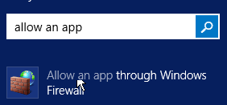

NAT G/W는 AWS의 서비스로 정식명칭은 NAT이며 NAT는 Router의 기능중 경로 설정관련 기능을 한다. NAT ⊂ Router   
HAproxy : L4,L7 S/W로 로드밸런서는 L4, 컨텐츠에따른 라우팅은 L7스위치다. L7스위치가 더 넓은 개념으로 L7스위치도 로드밸런싱이 가능하지만 로드밸런싱만 하는 스위치를 L7스위치라 하진 않는다.   

ESXi는 프라이빗 클라우드라고 보지 않을 수 있지만 Openstack은 프라이빗 클라우드이다.   

Tenant : 임차인(자원을 대여해 사용하는 사용자)   

업링크 : 물리 랜카드(물리적 어댑터)   
포트그룹   

    Management Network : 관리를위해 웹접속 가능한 IP를 갖고있는 포트그룹
    EXTERNAL : NAT가 위치해 있는 포트그룹
    INTERNAL : NAT를 비롯한 모든 VM이 연결되어 있는 포트그룹, 격리된 내부 네트워크로 NAT를 통해 외부와 통신한다.

### 내부네트워크에 있는 VM들이 인터넷 통신이 안될경우 확인순서(IP는 받은경우)
1. \# cat /proc/sys/net/ipv4/ip_forward
* 값이 1인지 확인 아닐경우 # sysctl -w net.ipv4.ip_forward=1
2. \# firewall-cmd --get-active-zone
* 방화벽이 제대로 구분되어 있는지 확인

#### 구성 순서
NAT G/W - DHCP - DNS - 각 서버 원격 연결 - DB - SMB - NFS   

## 윈도우 원격 데스크톱
Allow remote access to your computer 검색   
   
   
Allow remote connections to this computer 체크   
Allow connections only from … 체크 해제   

Allow an app through Windows 검색   
   
   
Remote Desktop Private,Public체크   

Windows Firewall with Advanced Security 검색   
   
Inbound Rules 선택   
   
New Rule선택   
   

## 우분투 DNS적용 안될때
```
sudo systemd-resolve --status
    DNS주소가 잘 들어가 있는지 확인 
sudo systemctl restart systemd-resolved.service
    DNS재시작 명령어

    OR
/etc/resolv.conf 에 DNS주소 추가
```

### 우분투(18.04) 네트워크 재시작 명령어
```
sudo systemctl restart systemd-networkd
```

### restart vs reload
서로 비슷하지만 reload는 서비스를 종료하지 않은 채 conf 설정파일만을 새로 갱신해준다.