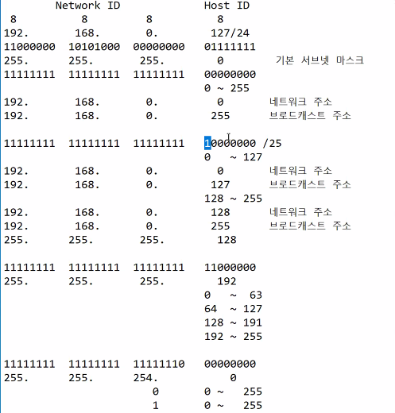

## HAproxy
접속주소를 IP가 아닌 도메인으로도 사용가능   
```
backend backend_servers
    balance            roundrobin
#    cookie  SVID insert indirect nocache maxlife 3m
    server             web01 web01.clown18.shop:80 cookie w1 check
    server             web02 web02.clown18.shop:80 cookie w2 check
    server             web03 web03.clown18.shop:80 cookie w3 check
```
시스템 설정후 재시작만이 아닌 **상태확인** 해볼것   

도메인 으로 설정시 부팅시 HAproxy가 실행되지 않는 문제가 있음   
원인 : DNS보다 HAproxy가 먼저 실행되기 때문으로 우선순위를 설정하면 해결가능하다.   

우선순위 설정
```
# vi /etc/systemd/system/multi-user.target.wants/haproxy.service
    [Unit]
    After=named.service추가
```
자동실행 서비스들이 모여있는 곳으로 어떤서비스들이 부팅시 실행되는지 확인 가능하며 해당 서비스 파일을 수정해서 우선순위를 설정할 수 있다.   

## 오픈스택
IaaS(Infrastructure as a service)형태의 클라우드 컴퓨팅 오픈소스 프로젝트   
프로세싱, 저장공간, 네트워킹의 가용자원을 제어하는 목적의 여러 개의 하위 프로젝트로 이루어져 있고 대시보드 프로젝트는 다른 하위 프로젝트의 운영 제어를 웹 인터페이스를 통해 담당한다. CMP(Cloud Management Platform)의 한 종류이다.   

### 가상화 환경
KVM(Hard - KVM) - LiBVIRT - Openstack

## 네트워크
IP             : 192.168.0.127     = 11000000 10101000 00000000 01111111   
subnet make : 255.255.255.0     = 11111111   11111111  11111111   00000000   
기본 서브넷 마스크라한다.

둘을 AND연산을 하면 앞의 3자리(192.168.0)은 그대로 나오고 마지막 자리는 0으로 나온다. 이때 서브넷 마스크의 값이 1인곳을 네트워크 영역 0인곳을 호스트 영역이라 한다.   
1 : 네트워크 비트   
0 : 호스트 비트   

네트워크 비트의 수가 늘어날수록 사용할 수 있는 IP의 수가 줄어든다. 서브넷 마스크가 255.255.255.128인경우 사용가능한 IP는 0 ~ 127 또는 128 ~ 255이고 이중 처음과 끝IP는 각각 네트워크 주소,브로드 캐스트 주소다.   

IP/24 = 서브넷마스크가 255.255.255.0이다.   
   

### 서브넷 마스크 사용이유
전체 네트워크를 사용하면 관리가 어렵고 낭비하는 IP가 많아지기 때문에 네트워크를 나누고자 사용