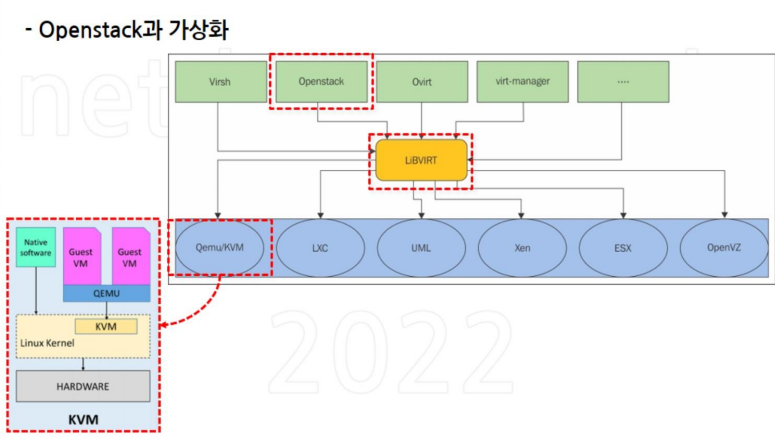
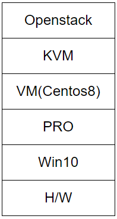
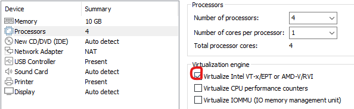
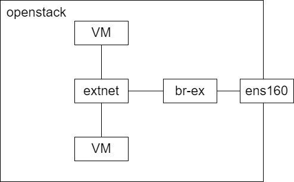

## 서브넷 마스크
/32 = 255.255.255.255 = 특정IP 하나를 의미(host only)   

## 오픈스택
### 가상화 구조
   

### 구성요소(서비스)
#### Core Service
VM생성에 필수적인 서비스   
Nova : 컴퓨트 서비스(VM에 CPU,RAM자원 할당(Provision)) - AWS(EC2)   

    모든 클러스터(여러 노드를 하나의 시스템처럼 동작하는 노드의 집합) 노드 컴퓨터에 설치되며 하이퍼바이저(KVM)을 통해 인스턴스(VM)의 라이프 사이클을 관리한다.

Glance : 이미지 서비스(OS) - AWS(AMI)   
Neutron : 네트워크 서비스(Router, vSwitch) - AWS(VPC)   

    가상 네트워크(vswitch) 및 가상 라우터를 생성하고 floating IP(공인IP,AWS(EIP)) 기능을 통해 ip를 설정, 부하분산 서비스와 방화벽등 기능함

Cinder : 스토리지(Block) 서비스 - AWS(EBS)   
Keystone : 보안(인증, 권한 제공,IP/PW를 통한 로그인,keypair) 서비스 - AWS(IAM)   

#### Optional Service(선택적 서비스)
Swift : 파일공유를 위한 오브젝트 스토리지(WebShare, rest api) - AWS(S3)   
Horizon : Web UI 제공   
Heat : IaC(자동화 도구, Infra as Code) - AWS(CloudFormation)   

### 실습환경 구조
   

### VM 생성
   
중첩된 가상화를 사용하기 때문에 저 부분을 체크한다.(HVM사용)

## Openstack 설치(CentOS 8)
### IP고정
```
# vi /etc/sysconfig/network-scripts/ifcfg-ens160
    TYPE=Ethernet
    BOOTPROTO=none
    NAME=ens160
    DEVICE=ens160
    ONBOOT=yes
    IPADDR=192.168.0.58
    NETMASK=255.255.240.0
    GATEWAY=192.168.0.1
    DNS1=8.8.8.8
    DNS2=8.8.4.4
# vi /etc/selinux/config
    SELINUX=disabled
    openstack설치시 권장사항

# dnf install network-scripts -y
    7의 yum대신 8에서는 dnf를 사용한다.
# systemctl disable firewalld
    openstack자체에 보안그룹이 존재하기 때문에 충돌의 여지가 있다
# systemctl disable NetworkManager
# systemctl enable network
# systemctl start network
```

### 설치
```
# dnf update -y
# dnf config-manager --enable powertools
# dnf install -y centos-release-openstack-yoga
# dnf update -y
# dnf install -y openstack-packstack
    openstack자동설치를 위한 패키지
# packstack --gen-answer-file /root/answers.txt
# vi /root/answers.txt
    CONFIG_DEFAULT_PASSWORD=Test1234!
    CONFIG_KEYSTONE_ADMIN_PW=Test1234!
        비밀번호 설정시 @로 시작하면 오류 발생
CONFIG_CINDER_VOLUMES_SIZE=100G
CONFIG_NTP_SERVERS=kr.pool.ntp.org
CONFIG_HEAT_INSTALL=y
CONFIG_NEUTRON_L2_AGENT=openvswitch
CONFIG_NEUTRON_ML2_TYPE_DRIVERS=vxlan,flat
flat : bridge를 통해 IP를 받아오기위함
CONFIG_NEUTRON_ML2_TENANT_NETWORK_TYPES=vxlan
CONFIG_NEUTRON_ML2_MECHANISM_DRIVERS=openvswitch
CONFIG_NEUTRON_OVS_BRIDGE_MAPPINGS=extnet:br-ex
CONFIG_NEUTRON_OVS_BRIDGE_IFACES=br-ex:ens160
CONFIG_PROVISION_DEMO=n

# packstack --answer-file /root/answers.txt
설정한 내용을 바탕으로 설치
```
네트워크 구조   
   

## Openstack 설정
### 네트워크 설정

#### external 생성
관리 -> 네트워크 -> 네트워크 생성
>이름 : EXTERNAL   
프로젝트 : admin   
공급자 네트워크 유형 : Flat   
물리적인 네트워크 : extnet   
외부네트워크 사용    
서브넷 생성   
서브넷 이름 : EXTERNAL_SUBNET   
네트워크 주소 : 192.168.0.0/20   
ip버전 : ipv4   
게이트웨이 : 192.168.0.1   
dhcp사용 안함   
Pools할당 : 192.168.8.1 ~ 192.168.8.126   

#### internal 생성
프로젝트 -> 네트워크 -> 네트워크   
>이름 : INTERNAL   
서브넷 이름: INTERNAL_SUBNET   
네트워크 주소 : 10.0.21.0/24   
게이트웨이IP : 10.0.21.1   
dhcp사용   
DNS : 192.168.0.66(교수님DNS).8.8.8.8(google)   

#### Router생성
프로젝트 -> 네트워크 -> 라우터
>이름 : ROUTER   
외부네트워크 : EXTERNAL   

#### 인터페이스 추가   
서브넷 : INTERNAL   

### Flavor 생성
관리 -> compute - Flavor
>이름 : m1.micro   
id : 6   
cpu : 1C   
ram : 1024mb   
Root 디스크 : 10   

### 이미지 생성
관리 -> compute -> 이미지
>이름:Centos7   
파일 : CentOS-7-x86_64-GenericCloud-2111.qcow2   
포맷 : QCOW2   

### 키 페어 생성
프로젝트 -> Compute -> 키 페어

### 방화벽
#### 생성
프로젝트 -> 네트워크 -> 보안그룹 ->보안 그룹 생성

#### 추가
프로젝트 -> 네트워크 -> 보안그룹 ->규칙 추가   
http,ssh,icmp(ping)추가   

내보냄 = outbound = egress(오픈스택에서 밖으로)   
들어옴 = inbound = ingress(밖에어 오픈스택으로)   

### Floating IP
프로젝트 -> 네트워크 -> Floating IP
외부에서 우리 아이피를 치고 들어올 수 있게 한다.(공인ip관리. 지금은 사설ip 쓰고있지만..)

### 인스턴스 생성
프로젝트 -> compute -> 인스턴스
이름 : WEB01   
소스   
>볼륩 크기 : 10   
사용 이미지 : Centos7   
Flavor : m1.micro   
네트워크 : INTERNAL   
보안그룹 : SG-WEB   
키 페어 : mz-open-key   

유동IP 연결   

접근 방법   
따로 비밀번호를 설정하지 않았기 때문에 키를통해 접근해야 하며 접근 계정은 centos를 사용한다.   
