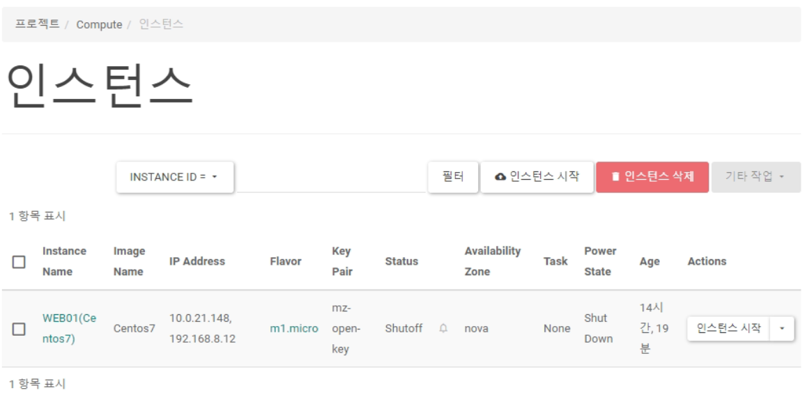
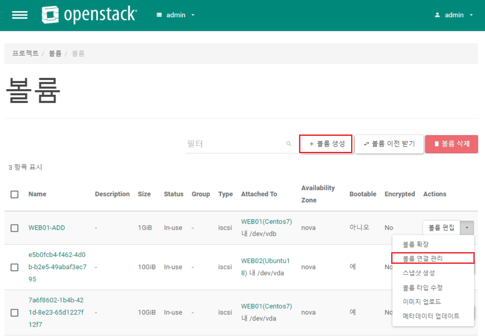
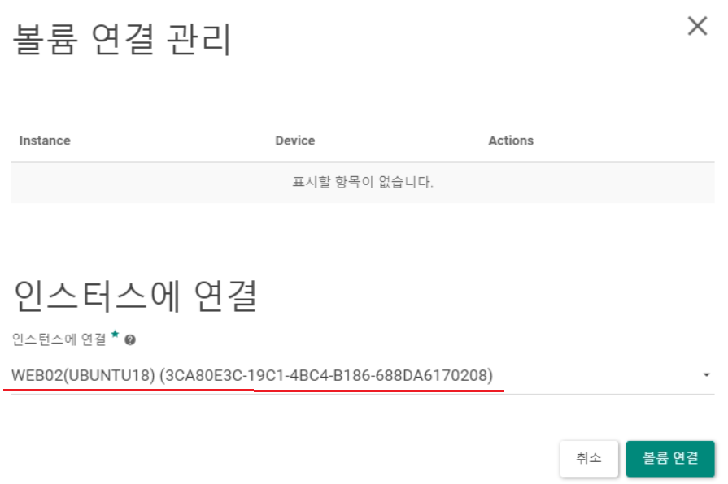
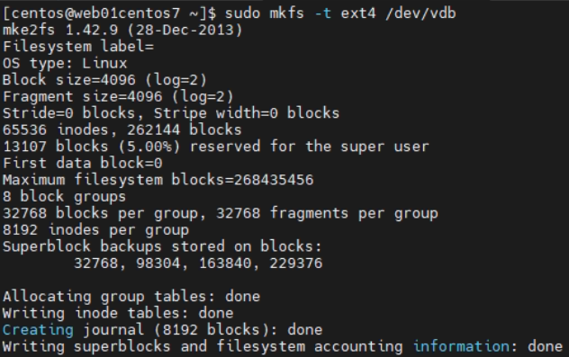
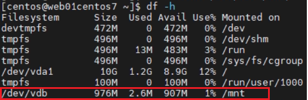
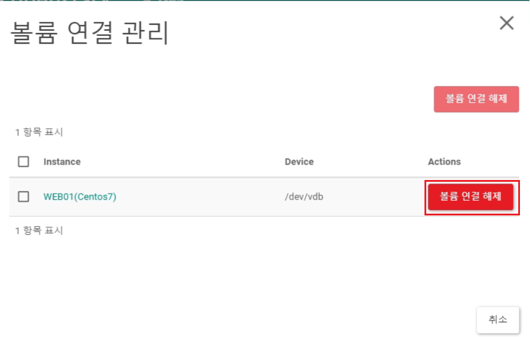
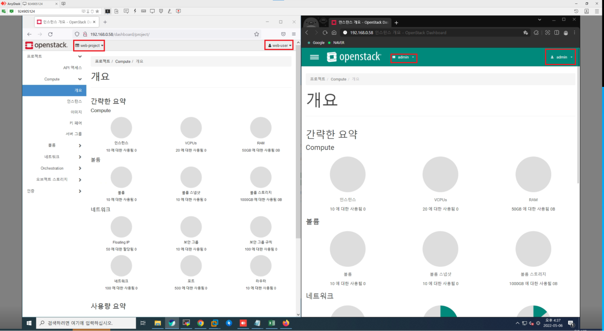
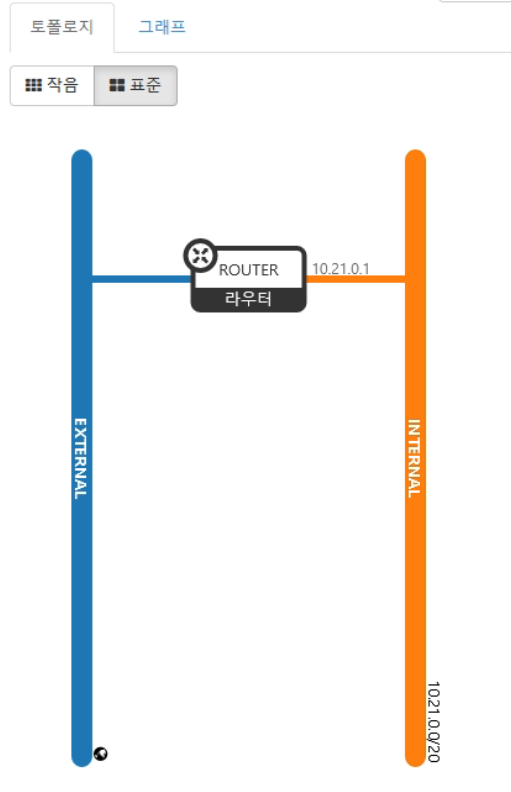
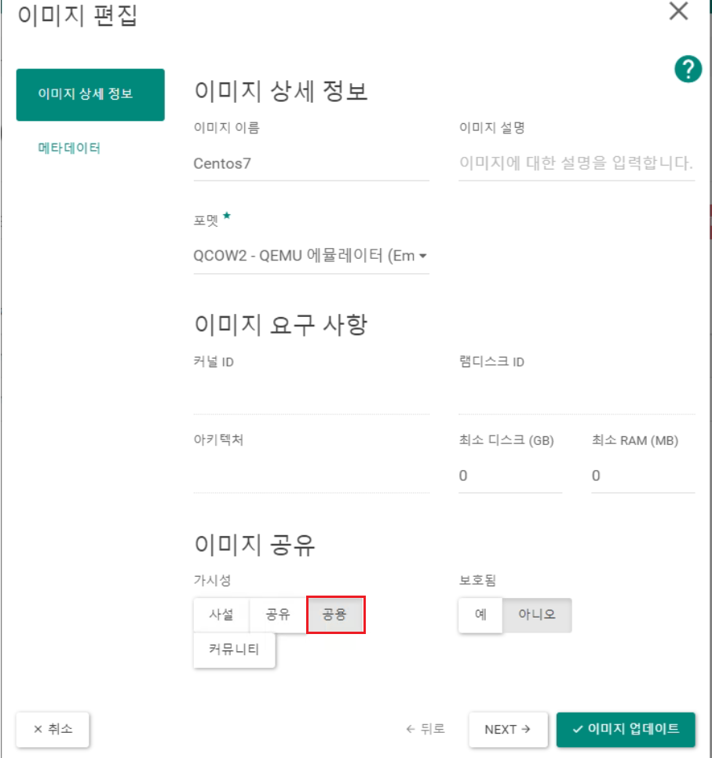

   
위에있는 인스턴스 시작은 생성이고 아래 Actions에 있는 인스턴스 시작이 해당인스턴스를 실행시키는 버튼이다.   

## Ubuntu 18 이미지 생성
IMG File : bionic-server-cloudimg-amd64.img   
포맷 : QCOW2 - QEMU에뮬레이터   

#### Floating IP   
외부 공인IP와 내부 사설IP를 연결해 외부에서 접근 가능하게 하며 이런 공인IP들을 관리할 수 있다.   

## 오브젝트 스토리지
프로젝트 -> 오브젝트 스토리지 -> 컨테이너   
저장소를 말하는 것으로 웹쉐어와 비슷하게 작동한다. 파일공유 뿐만이 아닌 접근을 url로 하기 때문에(http사용) 간단한 정적 페이지도 올릴 수 있다.   

## WEB02(Ubuntu18) 생성

    이름 : WEB02(Ubuntu18)   
    부팅소스 : IMG   
    IMG : Ubuntu18   
    disk : 10GB   
    flavor : m1.micro   
    net : internal   
    방화벽 : SG-WEB   
    key : mz-open-key   
    스크립트   
        OS를 설치하며 자동으로 실행되는 명령어로 쉡 스크립트를 사용한다.
        #!/bin/bash
        apt update
        apt install -y nginx
    
    웹페이지 간단제작 스크립트
        #!/bin/bash
        yum install -y httpd wget
        systemctl enable --now httpd
        cd /var/www/html
        wget http://192.168.0.61:8080/v1/AUTH_d66ef22fd2d6492da3ba48a5341d2ecf/mz33/index.html
        mkdir images && cd $_
        wget http://192.168.0.61:8080/v1/AUTH_d66ef22fd2d6492da3ba48a5341d2ecf/mz33/images/two-rabbit.jpg

## 스토리지 추가 & 해제
attach > mount > umount > detach 순으로 진행하며 해당 작업은 웹서비스가 구동중인 상태(인서비스)에서도 가능하다.   

프로젝트 -> 볼륨 -> 볼륨   
볼륨 생성 및 연결(attach)   
   
   
볼륨을 연결했다고 바로 사용가능한것이 아닌 마운트까지 해줘야 사용가능하다.   
```
$ lsblk
$ df -h
$ sudo mkfs -t xfs /dev/vdb
    포멧

$ sudo mount /dev/vdb /mnt/
$ df -h
```
   
   

연결 해제   
   

## 루트볼륨 확장(Scale UP - 수직적 확장)
늘리는건 가능하지만 줄이는건 불가능 하다.   
프로젝트 -> 볼륨 -> 볼륨 -> 볼륨 액션 -> 볼륨 확장   

## 일반 사용자
### 관리 페이지 차이
   
   
EXTERNAL은 admin이 갖고있는 네트워크이기 때문에 web-user는 ip를 확인 할 수 없다. IP확인을 위해서는 admin으로 접속후 관리 -> 네트워크 -> EXTERNAL -> 포트 로 접근해서 확인 가능   

## 네트워크 구성
EXTERNAL,INTERNAL네트워크 생성   
Router를 사용해 두 네트워크 연결   
Floating IP생성   
보안그룹 생성(방화벽)   

## 이미지 공유
   
admin계정으로 업로드한 이미지가 존재하는 상황에서 web-user가 추가로 이미지를 업로드하면 용량이 낭비되기 때문에 admin이 올린이미지를 공유해 사용한다.