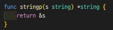

### defer

    정리작업을 수행하는 함수 지정
    현재 코드 블록이 끝날 때 자동으로 실행
    defer는 여러번 사용될 수 있다.
        나중에 defer된 함수가 먼저 실행된다.(LIFO)
    defer가 적용된 함수 중 반환값이 있는 함수의 반환값은 따로 읽을 방법이 없다.
    패닉 에러 발생시 발생 위치보다 앞에 선언 되어 있으면 에러 발생시 바로 종료하는게 아니라 defer구문이 실행되고 종료된다.

### 값에 의한 호출을 사용하는 Go

    Call by Value : 인자나 반환값이 복사된다.
    Call by Reference : 주소가 복사된다.
    기본 타입, 구조체는 call by value
    맵, 슬라이스 : call by reference
        맵과 슬라이스는 포인터로 구현 되었다.
        슬라이스는 길이 조정 외의 모든 조작이, 맵은 모든 조작이 원본에도 적용된다.(슬라이스append시 주소가 변경될 수 있기 때문)

## 포인터
값이 저장된 메모리의 위치 값(주소)를 저장하는 변수   
주소 연산자 &   
간접 연산자 *(dereferencing operator)   
모든 포인터는 어떤 타입을 가리키던간에 항상 같은 크기   

### 포인터의 제로 값은 nil
슬라이스, 맵, 함수, 채널, 인터페이스의 제로 값 : nil   
nil은 숫자 0이 아니기 때문에 nil을 숫자로 변경/변환하거나 숫자를 반대로 변환할 수 없다.   

포인터 역참조(*) 전에 nil인지 확인해야한다.(nil일경우 패닉 에러 발생)

### 포인터 타입

    포인터가 가리키는 값의 타입
    포인터가 어떤 타입의 값을 가리키는지 나타냄
    타입 이름 앞에 *
        포인터 역참조는 변수 이름 앞에 *

### 내장 함수 new()

    포인터 변수 생성
    해당 타입의 제로 값을 가리키는 포인터 반환
    var y = new(int)
        이렇게 생성하면 y는 int의 제로 값을 가리키는 포인터가 된다.

### 기본 타입의 리터럴이나 상수는 주소가 없으므로 주소연산자를 사용할 수 없다.
리터럴을 변수에 할당하고 해당 변수의 주소값을 이용한다.   
헬퍼함수를 작성하여 사용한다.(상수가 파라미터로 복사된다.)   
   

### Java의 데이터 타입
#### 원시 타입(Primitive Type)

    byte, short, int ,long, float, double, bool, char
    값 그 자체
    객체가 아니다.(call by value)

#### 클래스

    객체를 참조 변수로 참조해서 작업
        call by reference
    원시 타입의 클래스
        Byte, Short, Integer, Long, Float, Double, Boolean, Character

Go는 변수를 call by value로 할지, call by reference로 할지 선택할 수 있다.
>함수에 변수를 그냥 넘기는 것   
함수에 변수의 포인터를 넘기는 것

### 포인터는 변경 가능한 파라미터를 가리킨다.

    비 포인터 타입
        기본 타입, 배열, 구조체 -> 원본의 불변성
    포인터
        함수로 전달되면 포인터의 복사본이 생성 -> 원본에 닿아 수정할 수 있다.

### 포인터는 최후의 수단
>데이터 흐름 이해를 어렵게 한다.   
GC(가비지 컬렉터)에게 추가 작업 부하를 건다(포인터를 이용하면 주로 힙을 이용)   
가비지는 힙에 생성   

### 포인터로 성능 개선
>포인터는 모든 데이터 타입을 함수로 전달할 때 상수 시간이 걸린다.   
주소를 함수에 전달하므로, 모든 데이터 타입의 주소 길이는 같다.   
약 1메가 바이트 전달 기준으로 이상이면 포인터로 이하면 값 전달이 유리하다.   

### 제로 값과 값없음의 차이

    값이 있음
        0, ‘ ‘
    값이 없음
        NULL, ‘’, nil
    포인터를 이용하여 변수나 구조체의 항목의 값이 제로 값인지 없는 값인지 구분하는데 사용
    할당되지 않은 변수나 구조체 항목에 nil 포인터를 사용
    포인터는 변경가능함을 나타내므로 함수에서 nil 포인터를 직접 반환하는 것보다 콤마 OK 관용구를 사용
    nil 포인터를 함수의 파라미터나 구조체의 항목의 값으로 담아서 함수의 인자로 넘기면 nil 포인터를 통해서는 값을 저장할 수 없으므로 함수 안에서 값을 설정(간접 연산자 *를 사용하는것)할 수가 없다.

### 버퍼 슬라이스
메모리 용도에 따른 구분

    buffer
        데이터를 한 곳에서 다른 한 곳으로 전송하는 동안 일시적으로 그 데이터를 보관하는 메모리 영역
    cache
        데이터나 값을 미리 복사해 놓는 임시 장소 
    pool
        고정된 크기의 블록을 할당하여 메모리 동적 할당을 가능하게 해준다.

### 가비지 컬렉션 작업량 줄이기
버퍼를 이용하면 GC의 부하를 줄일 수 있다.   
가비지(Garbage)   
>더 이상 어떤 포인터도 가리키지 않는 데이터   

## 타입, 메서드, 인터페이스
### Go의 타입

    내장 타입
        기본 타입, 복합 타입
    구조체를 이용한 사용자 정의 타입
    구체적인 타입(concrete type)
        abstract type = general, super, 미완성(상속) <-> concrete = specific, sub, 완성(상속)

### 메서드

    타입을 위한 메서드
        반드시 패키지 블록 레벨에서 정의해야 한다.
    리시버
        func 키워드와 메서드 이름 사이에 리시버_이름 타입을 괄호 감싸서 정의
        리시버 식별자는 관례적으로 타입 이름의 짧은 약어인 첫 문자를 사용

### 포인터 리시버와 값 리시버
결정하는 규칙

    메서드가 리시버를 수정 -> 반드시 포인터 리시버 사용
    메서드가 nil 인스턴스를 처리할 필요 -> 반드시 포인터 리시버 사용
    메서드가 리시버를 수정하지 않음 -> 값 리시버 사용 가능
        이것은 타입에 선언된 다른 메서드에 따라 결정
        같은 타입에 다른 리시버가 포인터 리시버라면 리시버를 수정하지 않는 메서드라도 포인터 리시버 사용 -> 일관성을 위함
